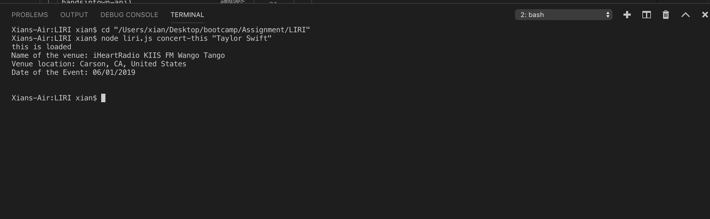
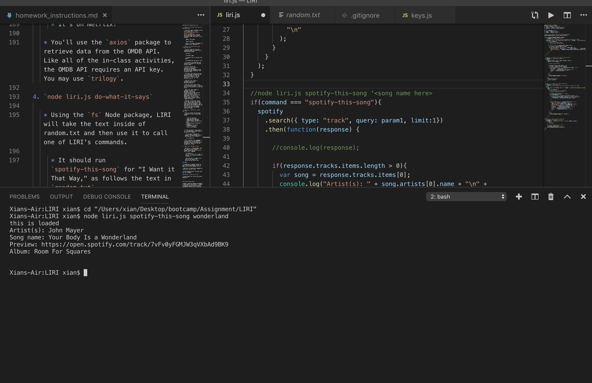
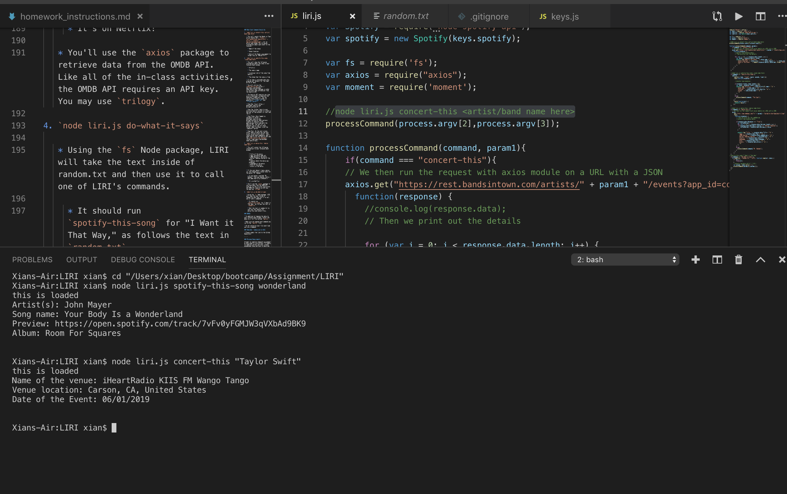
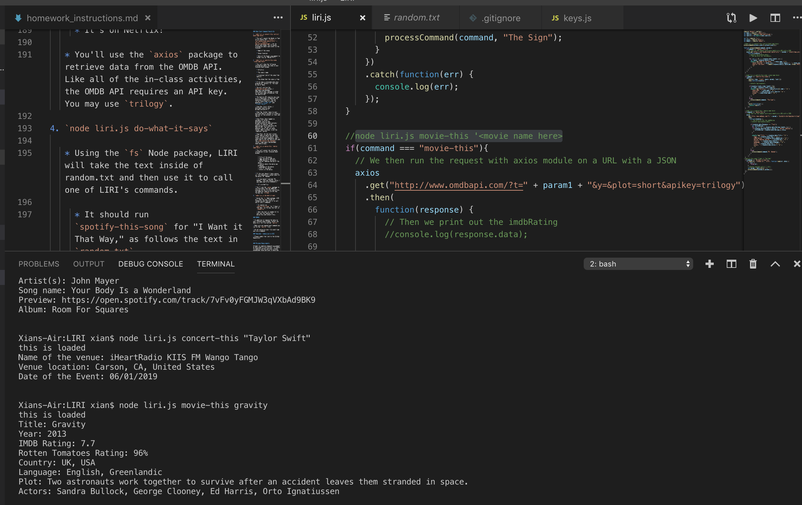
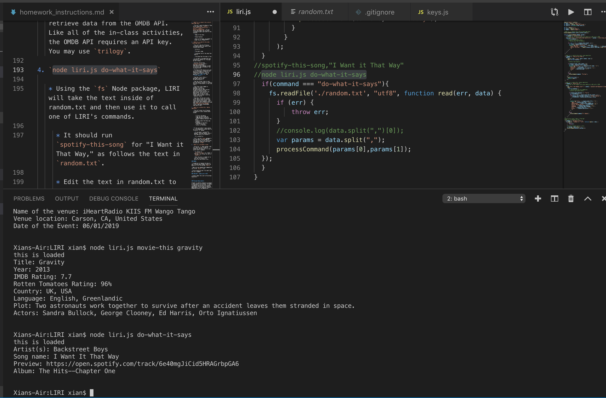

# LIRI
first I installed npm of spotify, axios, moment and dotenv

searched spotify information:

spotify
.search({ type: 'track', query: 'All the Small Things' })
.then(function(response) {
console.log(response);
})
.catch(function(err) {
console.log(err);
});

can do the following commands:

* `concert-this`
Show the information:

Name of the venue
Venue location
Date of the Event 

* `spotify-this-song`
Show the information:

Artist(s)
The song's name
A preview link of the song from Spotify
The album that the song is from

* `movie-this`
Show the information:

* Title of the movie.
* Year the movie came out.
* IMDB Rating of the movie.
* Rotten Tomatoes Rating of the movie.
* Country where the movie was produced.
* Language of the movie.
* Plot of the movie.
* Actors in the movie.

* `do-what-it-says`

Pictures of my work (I also uplode the imagies in my Github, incase it doesn't show in the readMe)

